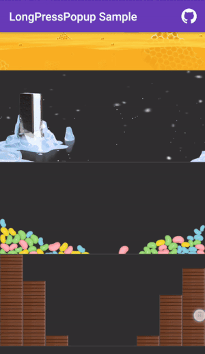

LongPressPopup
==============


<br />
You can try the demo app on google play store. <br />
https://play.google.com/store/apps/details?id=rm.com.longpresspopupsample <br />

A library that let you implement a behaviour similar to the Instagram's <br />
long press to show detail one, with the option to put every kind of views inside it, <br />
(even web views, lists, pagers and so on) show tooltips on drag over <br />
and handle the release of the finger over Views <br />

[Changelog] (CHANGELOG.md)<br />


Download
------
####Gradle:
```groovy
compile 'com.rm:longpresspopup:1.0.0'
```

<br />
<b>Min SDK version: 10 (Android 2.3.3) </b>
<br />

##Usage

####Basic
Here's a basic example <br />

```java
public class ActivityMain extends AppCompatActivity {
        
    @Override
        public void onCreate(Bundle savedInstanceState) {
            super.onCreate(savedInstanceState);
            setContentView(R.layout.activity_main);
            
            Button btn = (Button) findViewById(R.id.btn_popup);
            
            // Create a foo TextView
            TextView textView = new TextView(this);
            textView.setText("Hello, Foo!");
            
            LongPressPopup popup = new LongPressPopupBuilder(this)// A Context object for the builder constructor
                    .setTarget(btn)// The View which will open the popup if long pressed
                    .setPopupView(textView)// The View to show when long pressed 
                    .build();// This will give you a LongPressPopup object
                    
            // You can also chain it to the .build() mehod call above without declaring the "popup" variable before 
            popup.register();// From this moment, the touch events are registered and, if long pressed, will show the given view inside the popup, call unregister() to stop
        }
}
```



####Advanced
Here's a complete example with all the options <br />
```java
public class ActivityMain extends AppCompatActivity implements PopupInflaterListener,
            PopupStateListener, PopupOnHoverListener, View.OnClickListener {

    private static final String TAG = ActivityMain.class.getSimpleName();
     
    private TextView mTxtPopup;   
        
    @Override
    public void onCreate(Bundle savedInstanceState) {
        super.onCreate(savedInstanceState);
        setContentView(R.layout.activity_main);
        
        Button btn = (Button) findViewById(R.id.btn_popup);
        
        LongPressPopup popup = new LongPressPopupBuilder(this)
                        .setTarget(btn)
                        //.setPopupView(textView)// Not using this time
                        .setPopupView(R.layout.popup_layout, this)
                        .setLongPressDuration(750)
                        .setDismissOnLongPressStop(false)
                        .setDismissOnTouchOutside(false)
                        .setDismissOnBackPressed(false)
                        .setCancelTouchOnDragOutsideView(true)
                        .setLongPressReleaseListener(this)
                        .setOnHoverListener(this)
                        .setPopupListener(this)
                        .setTag("PopupFoo")
                        .setAnimationType(LongPressPopup.ANIMATION_TYPE_FROM_CENTER)
                        .build();
                
        // You can also chain it to the .build() mehod call above without declaring the "popup" variable before 
        popup.register();
    }
    
    
    // Popup inflater listener
    @Override
    public void onViewInflated(@Nullable String popupTag, View root) {
        mTxtPopup = (TextView) root.findViewById(R.id.txt_popup);
    }
    
    
    // Touch released on a View listener
    @Override
    public void onClick(View view) {
        if (mTxtPopup != null && view.getId() == mTxtPopup.getId()) {
            Toast.makeText(ActivityMain.this, "TextView Clicked!", Toast.LENGTH_SHORT).show();
        }
    }
    
    
    // PopupStateListener
    @Override
    public void onPopupShow(@Nullable String popupTag) {
        if(mTxtPopup != null) {
            mTxtPopup.setText("FooBar!");
        }
    }
    
    @Override
    public void onPopupDismiss(@Nullable String popupTag) {
        Toast.makeText(this, "Popup dismissed!", Toast.LENGTH_SHORT).show();
    }
    
    
    // Hover state listener
    @Override
    public void onHoverChanged(View view, boolean isHovered) {
        Log.e(TAG, "Hover change: " + isHovered + " on View " + view.getClass().getSimpleName());
    }
}
```
<br /> <br />
And here are the functions you can use to customize the Popup and it's behaviour from the
LongPressPopupBuilder class: <br />

* ```public LongPressPopupBuilder setTarget(View target)``` <b>(null by default) </b> <br />
    Select which view will show the popup view if long pressed <br /> <br />
* ```public LongPressPopupBuilder setPopupView(View popupView)``` <b>(null by default)</b> <br />
    Select the view that will be shown inside the popup <br /> <br />
* ```public LongPressPopupBuilder setPopupView(@LayoutRes int popupViewRes, PopupInflaterListener inflaterListener)``` <b>(0, null by default)</b> <br />
    Select the view that will be shown inside the popup, and give the popup that will be <br />
    called when the view is inflated (not necessarily when shown, so not load images and so on in this callback, <br />
    just take the views like in the OnCreate method of an Activity) <br /> <br />
* ```public LongPressPopupBuilder setLongPressDuration(@IntRange(from = 1) int duration)``` <b>(500 by default)</b> <br />
    Pretty self explanatory right? **Captain here, the long press time needed to show the popup <br /> <br />
* ```public LongPressPopupBuilder setDismissOnLongPressStop(boolean dismissOnPressStop)``` <b>(true by default)</b> <br />
    Set if the popup will be dismissed when the user releases the finger (if released on a View inside <br />
    the popup, the View's or the given OnClickListener will be called) <br /> <br />
* ```public LongPressPopupBuilder setDismissOnTouchOutside(boolean dismissOnTouchOutside)``` <b>(true by default)</b> <br />
    If ```setDismissOnLongPressStop(boolean dismissOnPressStop)``` is set to false, you can choose to make <br />
    the popup dismiss or not if the user touch outside it with this boolean <br /> <br />
* ```public LongPressPopupBuilder setDismissOnBackPressed(boolean dismissOnBackPressed)```  <b>(true by default)</b> <br />
    If ```setDismissOnLongPressStop(boolean dismissOnPressStop)``` is set to false, you can choose to make <br />
    the popup dismiss or not if the user press the back button <br /> <br />
* ```public LongPressPopupBuilder setCancelTouchOnDragOutsideView(boolean cancelOnDragOutside)``` <b>(true by default)</b> <br />
    Set if the long press timer will stop or not if the user drag the finger outside the target View <br />
    (If the target View is inside a scrolling parent, when scrolling vertically the long press timer <br />
    will be automatically stopped <br /> <br />
* ```public LongPressPopupBuilder setLongPressReleaseListener(View.OnClickListener listener)``` <b>(null by default)</b> <br />
    This is a standard OnClickListener, which will be called if the user release the finger on a view inside <br />
    the popup, you can use this method or set a standard OnClickListener on the View you want, it will be called <br />
    automatically for you <br /> <br />
* ```public LongPressPopupBuilder setOnHoverListener(PopupOnHoverListener listener)``` <b>(null by default)</b> <br />
    This listener will be called every time the user keeps dragging it's finger inside or outside the popup <br />
    views, with a View reference and a boolean with the hover state <br /> <br />
* ```public LongPressPopupBuilder setPopupListener(PopupStateListener popupListener)``` <b>(null by default)</b> <br />
    This listener will be called when the popup is shown or dismissed, use this listener to load images or compile text views and so on <br /> <br />
* ```public LongPressPopupBuilder setTag(String tag)``` <b>(null by default)</b> <br />
    This method sets a tag on the LongPressPopup, the given tag will be returned in all the listeners. You can also set it in the build(String tag) <br /> 
    method <br /> <br />
* ```public LongPressPopupBuilder setAnimationType(@LongPressPopup.AnimationType int animationType)``` <b>(none by default)</b> <br />
    This method set the opening and closing animation for the popup, can be none or from-to Bottom, Top, Right, Left, Center
    
<br /><br />

Also, the LongPressPopup class gives some utility methods, like <br /> 
* ```public void register()``` <br />
    Which means that the popup is listening for touch events on the given view to show itself <br /> <br />
* ```public void unregister()``` <br />
    Which makes to popup stop listening for touch events and dismiss itself if open  <br /> <br />
* ```public void showNow()``` <br />
    Which shows immediately the popup
* ```public void dismissNow()``` <br />
    Which dismiss immediately the popup if open

<br /> <br />

License
--------

    Copyright 2016 Riccardo Moro.

    Licensed under the Apache License, Version 2.0 (the "License");
    you may not use this file except in compliance with the License.
    You may obtain a copy of the License at

       http://www.apache.org/licenses/LICENSE-2.0

    Unless required by applicable law or agreed to in writing, software
    distributed under the License is distributed on an "AS IS" BASIS,
    WITHOUT WARRANTIES OR CONDITIONS OF ANY KIND, either express or implied.
    See the License for the specific language governing permissions and 
    limitations under the License.
